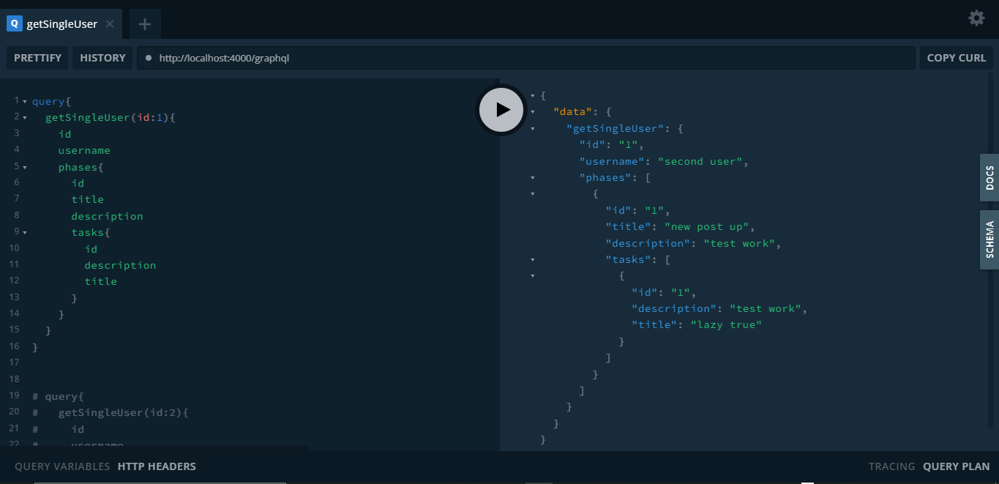

# crave_tech

This is a simple graphql api that helps Startups monitor tasks and sub tasks.
Tools and Frameworks used:
* NodeJS
* Express
* TypeGraphql
* TypeOrm
* Twitter  API

## Getting Started

First, clone this repo:
```bash
git clone <repo>
```
Then, install all required dependencies:
```bash
npm install
```

lastly, run the development server by:
```bash
npm start
# or
yarn start
```

Open [http://localhost:4000/graphql] with your browser to interact with the graphiql playground.

## Sample Query and Data Body


## Limitation/Todos(Areas for modification/improvement)
* Build Test Pipeline
* Implement frontend to consume GraphQL Api
* Build better error handler
